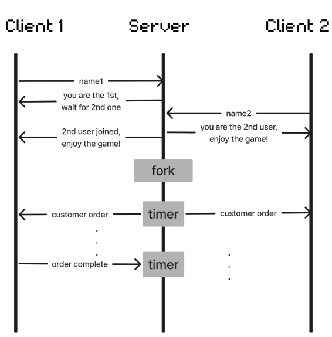
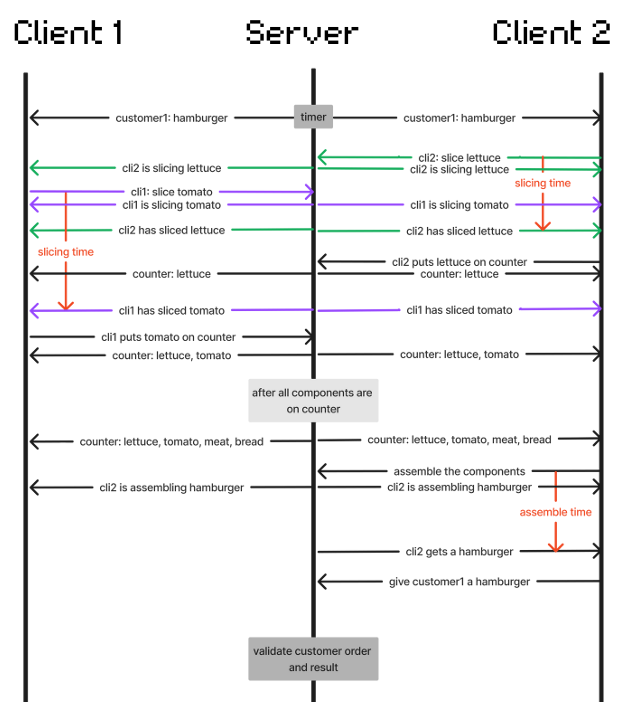

# NYCU webProgramming 2024 final project
授課教授：嚴力行
1. introduction:
This is a game inspired by Overcooked and implemented using socket programming.
2. architecture:
   
3. workflow
   - overall
     
     
   - when ordering hamburger
     
     
4. env setup
   - build up SFML
    ```shell
    sudo apt update && sudo apt upgrade
    
    # install prerequisites
    sudo apt install build-essential libglew-dev libjpeg-dev libfreetype6-dev libx11-dev libxrandr-dev libflac-dev libogg-dev libvorbis-dev libopenal-dev libudev-dev libpthread-stubs0-dev
    
    # install fonts
    sudo apt install ttf-mscorefonts-installer
    sudo cp /usr/share/fonts/truetype/msttcorefonts/arial.ttf .../projectDirectory

    # install SFML
    sudo apt install libsfml-dev
    ```
    - build the project
    ```shell
    make client
    make serv
    ./serv
    ./client 127.0.0.1 ${client_name}
    ```
